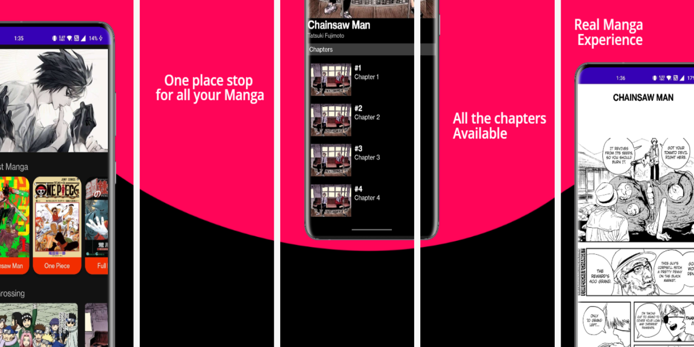
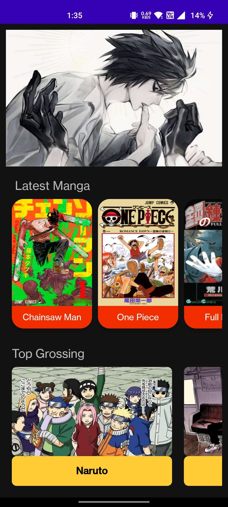
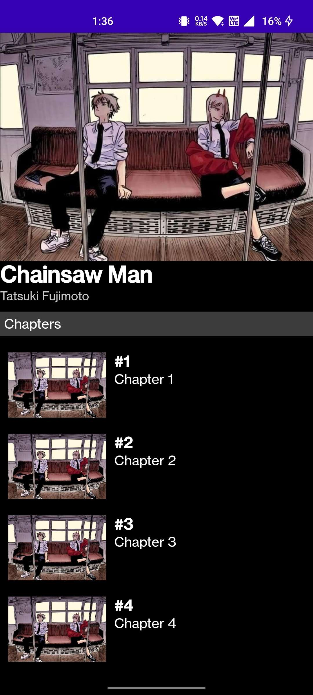
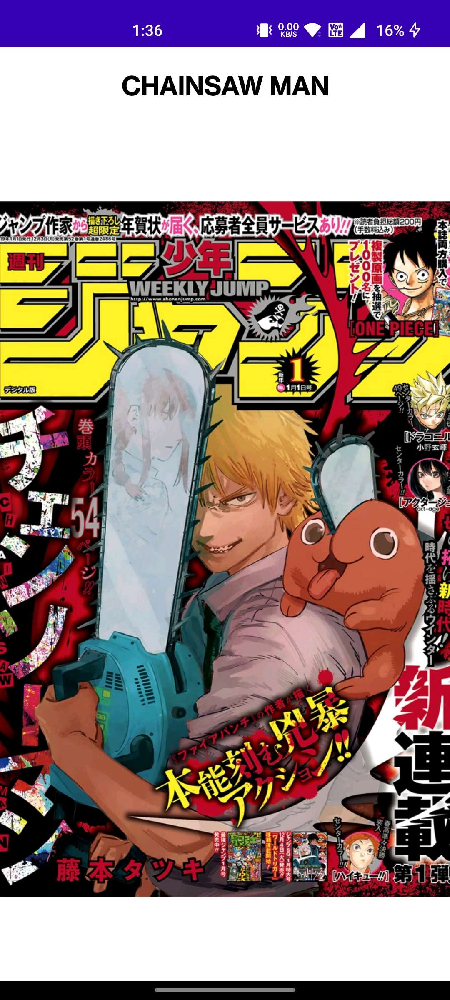
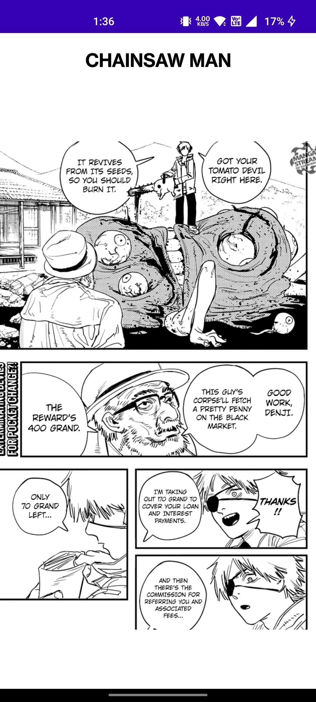

# MiyuManga

[![MIT License][license-shield]][license-url]
[![LinkedIn][linkedin-shield]][linkedin-url]
[![Partner][contributors-shield]][contributors-url]

<!-- PROJECT LOGO -->
 

  
  
  <h3 align="center">MiyuManga</h3>

  

    An Awesome Manga Reader made with Love!
     
    <a href="https://github.com/AshishKumarD/MiyuManga"><strong>Explore the docs »</strong></a>
     
     
    <a href="https://github.com/AshishKumarD/MiyuManga">View Demo</a>
    ·
    <a href="https://github.com/AshishKumarD/MiyuManga/issues">Report Bug</a>
    ·
    <a href="https://github.com/AshishKumarD/MiyuManga/issues">Request Feature</a>
  

<!-- TABLE OF CONTENTS -->

  
Table of Contents

  <ol>
    <li>
      <a>Introduction</a>
        <ul>
          <li><a href="#about-the-project">About the Project</a></li>
        </ul>
        <ul>
          <li><a href="#built-with">Built With</a></li>
        </ul>
    </li>
    <li>
      <a>Screenshots</a>
        <ul>
          <li><a href="#home-screen">Home Screen</a></li>
        </ul>
        <ul>
          <li><a href="#chapters">Chapters page</a></li>
        </ul>
        <ul>
          <li><a href="#cover-page">Cover Page</a></li>
        </ul>
        <ul>
          <li><a href="#reading-page">Reading page</a></li>
        </ul>
    </li>
    <li><a href="#scope">Future Scope</a></li>
    <li><a href="#conclusion">Conclusion</a></li> 
  </ol>

## About The Project

 

MiyuManga combines functionality, convenience, and aesthetics to provide a comprehensive manga reading experience on the Android platform. With its extensive manga library, seamless navigation, and inclusion of fan art, MiyuManga aims to delight manga enthusiasts and create a thriving community of manga lovers within the app.

(<a href="#readme-top">back to top</a>)

## Built With

* Android Studio:
Android Studio is exclusively designed for developing Android applications. It consists of all Android SDK tools to design, develop, maintain, test, debug and publish our app.

* Android Software Development Kit(SDK):
Of the main tools used in developing android applications, as it packages many core features into one SDK and it can be used in the application easily. This helps us to avoid writing lot of code, and building applications faster.

* Android Debug Bridge(ADB):
Android SDK uses ADB tool as a connection device which allows us to connect the Android Devices or Emulator with the machine via USB. After developing or while developing applications, we can connect with the device to check how the application runs. Later, we can debug and run the applications.

(<a href="#readme-top">back to top</a>)

## Screenshots

### Home Screen

### Chapters

### Cover Page

### Reading Page

(<a href="#readme-top">back to top</a>)

## Future Scope

MiyuManga has the potential for further development and enhancement, allowing it to become an even more immersive and engaging platform for manga enthusiasts. The following potential future scope areas can expand the app's capabilities and attract a broader user base:

1. Personalization: One aspect that can greatly enhance the user experience is the implementation of user profiles and customization options. By allowing users to create personalized reading lists, bookmark their favorite manga, and receive tailored recommendations based on their preferences and reading history, MiyuManga can create a more personalized and engaging experience.

2. Offline Reading: Introducing offline reading capabilities would be a valuable addition to MiyuManga. Enabling users to download manga chapters for offline access would allow them to enjoy their favorite manga even when they don't have an internet connection. This feature would greatly enhance convenience and accessibility for users, ensuring they can continue reading their manga uninterrupted.

3. Community Interaction: Building a community aspect within MiyuManga can foster a sense of belonging and interaction among manga enthusiasts. Implementing a discussion forum or comment section where users can engage with each other, share their thoughts on manga series, and participate in community-driven events or challenges would help create a vibrant and active community within the app.

4. Social Integration: Integrating MiyuManga with popular social media platforms, such as Facebook or Twitter, would allow users to easily share their favorite manga titles, chapters, or fan art with their friends and followers. This integration would not only promote user engagement but also help expand the app's reach as users share their experiences and recommendations with their social networks.

5. Multi-language Support: To cater to a global audience, MiyuManga could add support for multiple languages. Enabling users to access and enjoy manga content in their preferred language would help break language barriers and attract a more diverse user base, expanding the app's popularity internationally.

6. Enhanced Recommendation System: Implementing an advanced recommendation system powered by machine learning algorithms would greatly enhance the user experience. By analyzing users' reading preferences, ratings, and behavior patterns, MiyuManga can provide highly personalized and accurate recommendations for new manga titles, increasing user satisfaction and helping them discover series they may not have encountered otherwise.

7. In-App Purchases and Subscriptions: Introducing a monetization model through in-app purchases or subscriptions can provide additional revenue streams for MiyuManga. Users could access exclusive content, remove ads, unlock premium features, or subscribe to premium membership plans, supporting the ongoing development and maintenance of the app while offering enhanced benefits to dedicated users

(<a href="#readme-top">back to top</a>)

## Conclusion

In conclusion, by considering these potential future scope areas, MiyuManga has the opportunity to evolve into a comprehensive and user-centric application, offering a highly personalized manga reading experience. The inclusion of personalization features, offline reading capabilities, community interaction, social integration, multi-language support, an enhanced recommendation system, and monetization options will contribute to the app's growth and success, attracting a larger user base and ensuring an immersive and enjoyable experience for manga enthusiasts worldwide.

(<a href="#readme-top">back to top</a>)

 

<!-- MARKDOWN LINKS & IMAGES -->
<!-- https://www.markdownguide.org/basic-syntax/#reference-style-links -->
[contributors-shield]: https://img.shields.io/github/contributors/othneildrew/Best-README-Template.svg?style=for-the-badge
[contributors-url]: https://https://github.com/TriptiKumari11

[license-shield]: https://img.shields.io/github/license/othneildrew/Best-README-Template.svg?style=for-the-badge
[license-url]: https://github.com/othneildrew/Best-README-Template/blob/master/LICENSE.txt
[linkedin-shield]: https://img.shields.io/badge/-LinkedIn-black.svg?style=for-the-badge&logo=linkedin&colorB=555
[linkedin-url]: https://linkedin.com/in/ashishkumard1111
[product-screenshot]: Images/banner.png

